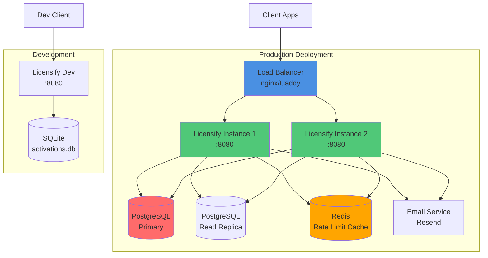
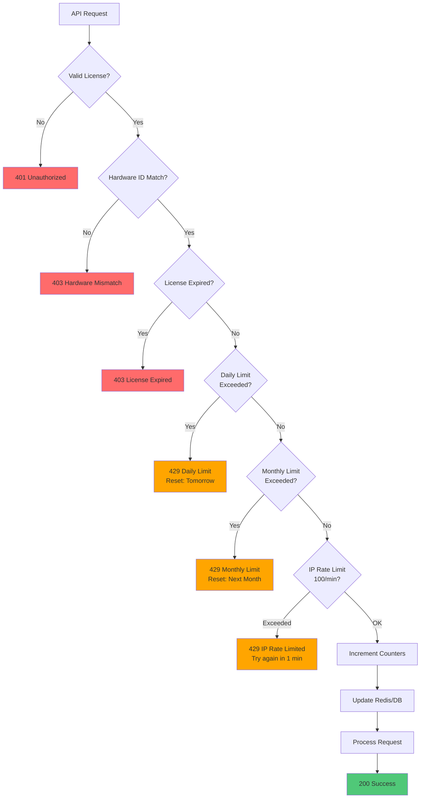
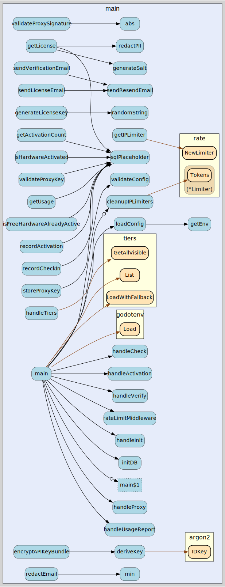
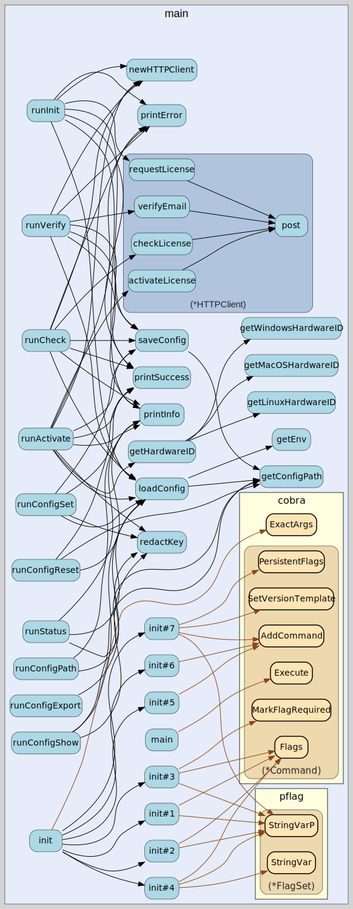

# Flow Diagrams

This directory contains auto-generated flow diagrams from the codebase.

## Architecture Diagrams

### Deployment Architecture



**Production Setup:**
- Load balancer distributes traffic across instances
- PostgreSQL for production reliability
- Redis for distributed rate limiting
- Read replicas for /check endpoint scaling

**Development Setup:**
- Single instance with SQLite
- No external dependencies required
- Perfect for testing and local development

### Rate Limiting Algorithm



**Rate Limit Hierarchy:**
1. **License Validation** - Auth + hardware binding
2. **Daily Quota** - Per-license daily limit
3. **Monthly Quota** - Per-license monthly limit  
4. **IP Rate Limit** - 100 requests/min per IP (DDoS protection)

**Counters Reset:**
- Daily: Midnight UTC
- Monthly: 1st of month UTC
- IP: Rolling 1-minute window

## Auto-Generated Diagrams

### API Handler Call Flow



This diagram shows the complete call graph of API endpoint handlers and their dependencies. Generated using `go-callvis`.

### CLI Command Execution Flow



Visualizes the CLI command structure and execution paths through the cobra command framework. Generated using `go-callvis`.

### Package Structure

See `structure.puml` for the PlantUML source of the package architecture.

## Files

- **api-handlers.svg** - API handler call flow
- **api-handlers.gv** - GraphViz source
- **cli-flow.svg** - CLI command execution flow
- **cli-flow.gv** - GraphViz source
- **structure.puml** - Package structure diagram

## Generating Locally

```bash
# Run the generation script
./tools/generate-diagrams.sh

# View diagrams
open docs/diagrams/api-handlers.svg
```

## Tools Used

- **go-callvis** - Generates call graphs from Go code
- **goplantuml** - Creates PlantUML diagrams from Go structures
- **graphviz** - Renders DOT files to SVG
- **plantuml** - Renders PlantUML to SVG

## GitHub Actions

Diagrams are automatically regenerated on every push to main when Go files change.
See `.github/workflows/generate-diagrams.yml`

## Manual Diagram Sources

Hand-crafted Mermaid diagrams are in the main README.md showing:
- Complete license flow (init → verify → activate)
- License check flow
- Proxy mode flow
- Direct mode flow
